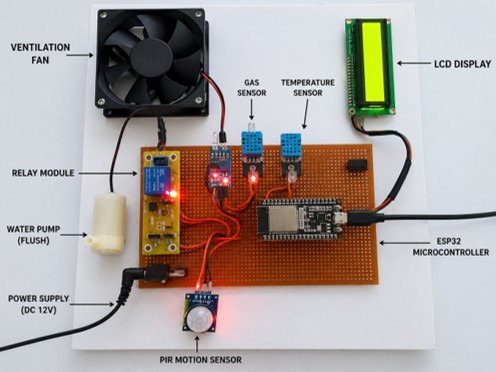
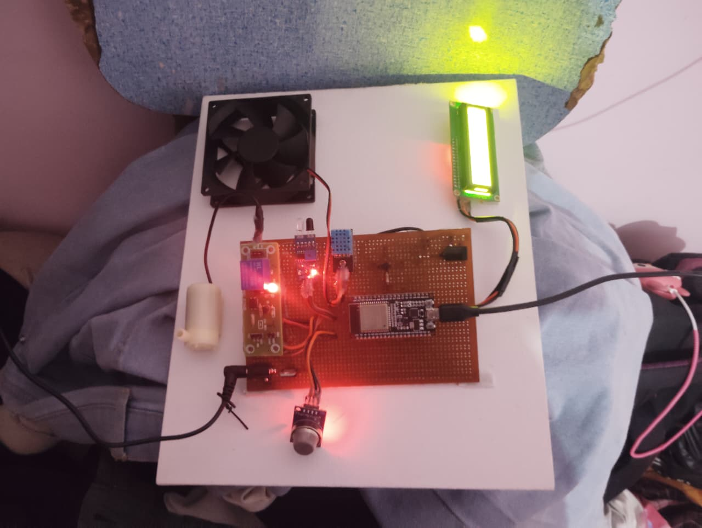
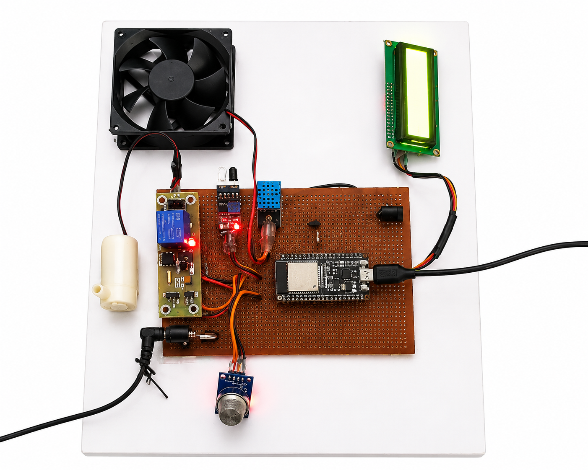

#  Smart Toilet Automation System

##  Overview

The Smart Toilet Automation System is an IoT-based solution designed to monitor and improve hygiene conditions in public and private restrooms. The system uses sensors and automation to detect environmental conditions and trigger appropriate actions.

##  Objective

To develop a low-cost, efficient hygiene monitoring system that ensures cleanliness and reduces manual intervention.

##  Features

* 🚶 Motion detection using PIR sensor
* 🌫️ Air quality monitoring using MQ-135 gas sensor
* 🌡️ Temperature and humidity tracking (DHT11)
* 💧 Water flow monitoring
* ⚡ Automated response using relay control
* 📊 Real-time data processing via ESP32

##  Tech Stack

* **Hardware:** ESP32, MQ-135, DHT11, PIR Sensor, Water Flow Sensor, Relay Module
* **Software:** Arduino IDE
* **Programming Language:** Embedded C / Arduino

##  System Architecture

The system collects environmental data through sensors and processes it using the ESP32 microcontroller. Based on threshold values, automated actions such as activating exhaust systems or alerts are triggered.

##  Project Images

##  Documentation

*  [Project Report](docs/report.pdf)
*  [Presentation Slides](docs/presentation.pptx)

## How to Run

1. Open the Arduino IDE
2. Connect ESP32 to your system
3. Upload the code from `/code/smart_toilet.ino`
4. Monitor output via Serial Monitor

##  Future Improvements

* Mobile app integration for real-time monitoring
* Cloud-based data storage and analytics
* AI-based hygiene prediction system

##  Author

Madhumitha Anand
Akshaya M
Mohammed Nihal A
B.Tech AI & DS

---
